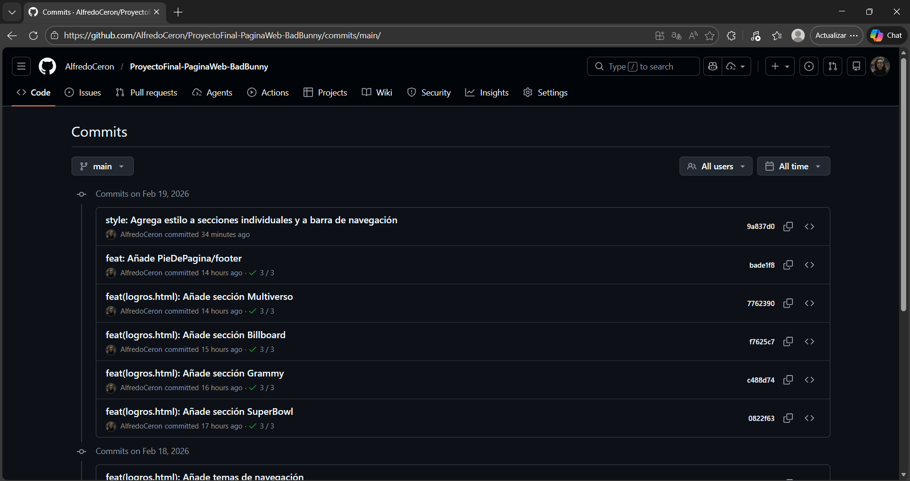
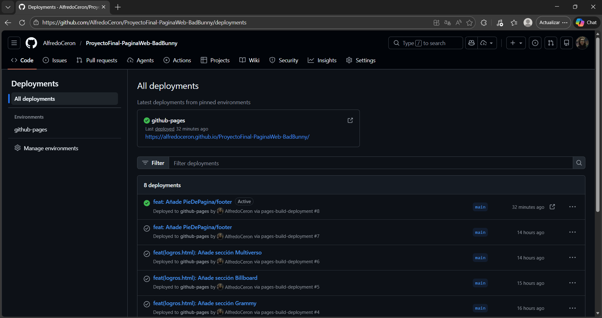
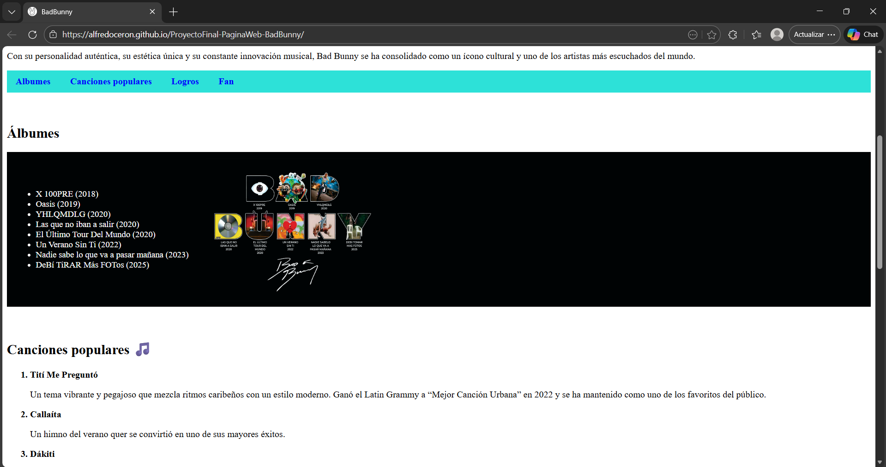
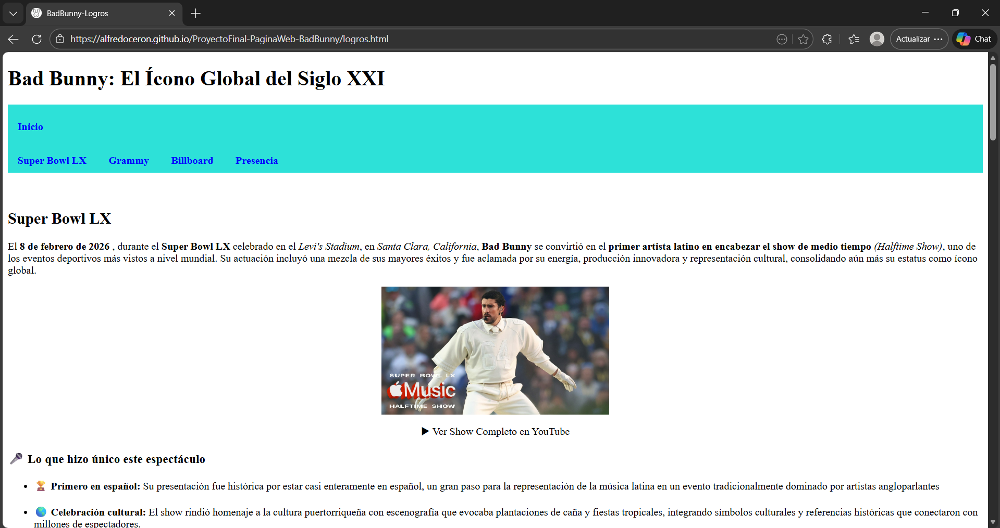
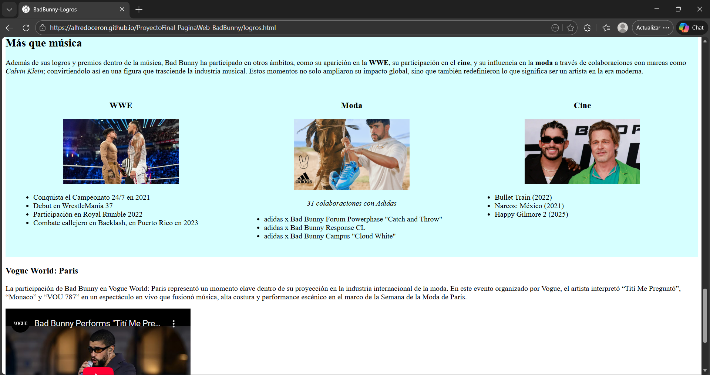

# 📸 Evidencias – Proyecto Final: Blog de Bad Bunny

## 📌 Información General

En este documento se recopilan las evidencias del desarrollo del proyecto, incluyendo capturas de pantalla relevantes y el acceso a la página desplegada en GitHub Pages.

**Nombre del Proyecto:** Proyecto Final – Blog de Bad Bunny  
**Autor:** Eduardo Alfredo Cerón Maciel  
**Repositorio:** https://github.com/AlfredoCeron/ProyectoFinal-PaginaWeb-BadBunny  
**Demo en Vivo:** https://alfredoceron.github.io/ProyectoFinal-PaginaWeb-BadBunny/

---

## 📂 Ubicación de las evidencias

Todas las imágenes se encuentran dentro de la carpeta:

    /evidencias

> - `historial-commits.png`
> - `github-pages.png`
> - `web-Discografia.png`
> - `web-SuperBowl.png`
> - `web-Multiverso.png`

---

## 🧾 Historial de Commits

---

## 🌐 Vista de GitHub Pages

---

## 🖥️ Vista del sitio web abierto

Discografía

Super Bowl LX

Multidisciplinas

---

## 🔗 Enlace a la página desplegada

👉 **GitHub Pages:**\
`https://alfredoceron.github.io/ProyectoFinal-PaginaWeb-BadBunny/`

---

## 🔗 Enlace al respositorio

👉 **GitHub:**\
`https://github.com/AlfredoCeron/ProyectoFinal-PaginaWeb-BadBunny`

---

# Aprendizajes

## 1. ¿Qué fue lo más fácil y lo más retador?

_Lo más fácil fue aprovechar las herramientas del editor de código para agilizar el desarrollo. Por ejemplo, el autocompletado automático facilitó mucho la escritura de etiquetas pues redujo errores y aceleró la codificación. También fue muy útil emplear atajos como `li*4` que genera múltiples elementos de lista automáticamente en lugar de escribirlos uno por uno. Además, la extensión **Prettier** fue de gran ayuda para visualizar mejor el código pues permitió mantener el código bien identado y organizado._

_Mientras que lo más complicado fue incluir un vídeo reproducible, lo retador radicó en que quería anexar el Super Bowl LX Halftime Show pero Youtube restringe esa posibilidad y cómo alternativa quise "cargarlo manualmente" pero pesaba mucho (aprox 200MB) por lo que tuve problemas con github por el tamaño del vídeo y luego con git al querer eliminar un archivo del historial y luego forzar un push. De igual manera, otra dificultad que tuve fue considerar sobre qué trataría el proyecto y su contenido, ya que en un inicio contemplaba realizar una tienda semejante a BonIce pero consideré que sería una página muy simple, corta y sencilla para entregar como un Proyecto Final pues no tendría muchas catgeogrías/secciones._

---

## 2. ¿Qué etiquetas semánticas usaste y por qué?

_Al inicio del documento incluí `<!DOCTYPE html>` para indicar al navegador que el archivo está escrito en HTML5 y así interprete correctamente la estructura del código. Posteriormente usé `<header>` para contener el título principal y la barra de navegación. La etiqueta `<nav>` para agrupar los enlaces de navegación y facilitar la organización visual como la accesibilidad. Con `<title>` definí el nombre que aparece en la pestaña del navegador. Para dividir el contendio principal empleé `<section>` pues cada bloque (Álbumes, Canciones populares, Super Bowl, Premios Grammy, etc) representa una temática distinta dentro del sitio; y en cada bloque utilicé encabezados como `<h1>`, `<h2>` y `<h3>` para jerarquizar la información correctamente. `<footer>` para cerrar de forma estructurada la página y colocar créditos_

---

## 3. ¿Cómo organizaste tus commits?

_Organicé mis commits de manera progresiva conforme iba desarrollando el proyecto. Generalmente realizaba un commit cada vez que terminaba una sección/categoría específica de la página, por ejemplo: la barra de navegación, la sección de Álbumes, Canciones Populares, Super Bowl, la sección del formulario, etc._

_Este enfoque me permitió llevar un control claro del avance del proyecto, ya que cada commit representaba una mejora o una parte funcional completada._

---

## 4. ¿Qué mejorarías en la siguiente iteración?

_Principalmente mejoraría el diseño visual y la experiencia del usuario. Trabajaré más en la parte de CSS para lograr un diseño más moderno y atractivo; incorporando tipografías más estilizadas y una paleta de colores más consistente._

_Me gustaría darle formato al menú de navegación y también arreglaré las 3 columnas de la sección "Presencia" ya que no se visualiza correctamente en diferentes tamaños de pantalla._

_En cuanto a funcionalidad, me gustaría integrar JavaScript en el formulario de la "Encuesta para fan" para hacerlo más dinámico, por ejemplo mostrando mensajes personalizados al enviar las respuestas._

---

---

**Documento elaborado como parte del Proyecto Final de Desarrollo Web.**
